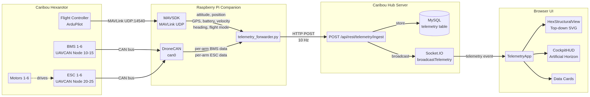

# Caribou Telemetry Pipeline

**Version:** May 2026  
**Author:** Pan Robotics

This document describes the complete telemetry pipeline for the Caribou hexarotor — from hardware sensors on the airframe, through the companion computer relay, into the Caribou Hub server, and finally rendered in the browser-based flight dashboard. The Caribou is a large hexarotor with **6 independent motor/ESC/battery arms**, each monitored individually via UAVCAN, alongside centralised flight controller data via MAVLink.

---

## Architecture Overview



The pipeline has four stages:

| Stage | Location | Protocol | Role |
|---|---|---|---|
| 1. Sensor Collection | Caribou airframe | MAVLink UDP + UAVCAN CAN | Raw sensor data from FC, BMS, ESC |
| 2. Companion Relay | Raspberry Pi | Python (MAVSDK + DroneCAN) | Aggregate, assemble, and forward via HTTP |
| 3. Hub Ingestion | Caribou Hub server | REST + Socket.IO | Validate, store, broadcast |
| 4. Frontend Display | Browser | React + SVG + Canvas | Render structural view, cockpit HUD, data cards |

---

## Stage 1: Hardware Sensors

The Caribou hexarotor has the following telemetry sources:

### Flight Controller (ArduPilot)

The flight controller is the central authority for vehicle state. It communicates via **MAVLink over UDP** (default port 14540) to the companion computer.

| Data Category | MAVLink Message | Fields Collected | Update Rate |
|---|---|---|---|
| Attitude | `ATTITUDE` | roll_deg, pitch_deg, yaw_deg | 10 Hz |
| Position | `GLOBAL_POSITION_INT` | latitude_deg, longitude_deg, absolute_altitude_m, relative_altitude_m | 10 Hz |
| GPS | `GPS_RAW_INT` | num_satellites, fix_type (0–5) | 2 Hz |
| FC Battery | `BATTERY_STATUS` | voltage_v, remaining_percent | 2 Hz |
| Velocity | `LOCAL_POSITION_NED` | vx, vy, vz → airspeed_ms, vertical_speed_ms | 10 Hz |
| Heading | `VFR_HUD` | heading_deg (0–360) | 10 Hz |
| Flight Mode | `HEARTBEAT` | flight_mode string (STABILIZE, LOITER, AUTO, RTL, LAND, etc.) | 2 Hz |
| In-Air Status | `IN_AIR` | boolean (armed + altitude threshold) | 10 Hz |

### UAVCAN Bus (6× Independent Arms)

Each of the 6 arms has its own BMS and ESC on the CAN bus, identified by unique node IDs. The companion computer runs a DroneCAN listener on the `can0` interface.

**BMS Nodes (Battery Management System):**

| Node ID | Arm | UAVCAN Message | Fields |
|---|---|---|---|
| 10 | Arm 1 (top-left) | `uavcan.equipment.power.BatteryInfo` | voltage_v, current_a, temperature_c, soc_pct, soh_pct |
| 11 | Arm 2 (top-right) | `uavcan.equipment.power.BatteryInfo` | voltage_v, current_a, temperature_c, soc_pct, soh_pct |
| 12 | Arm 3 (right) | `uavcan.equipment.power.BatteryInfo` | voltage_v, current_a, temperature_c, soc_pct, soh_pct |
| 13 | Arm 4 (bottom-right) | `uavcan.equipment.power.BatteryInfo` | voltage_v, current_a, temperature_c, soc_pct, soh_pct |
| 14 | Arm 5 (bottom-left) | `uavcan.equipment.power.BatteryInfo` | voltage_v, current_a, temperature_c, soc_pct, soh_pct |
| 15 | Arm 6 (left) | `uavcan.equipment.power.BatteryInfo` | voltage_v, current_a, temperature_c, soc_pct, soh_pct |

**ESC Nodes (Electronic Speed Controller):**

| Node ID | Arm | UAVCAN Message | Fields |
|---|---|---|---|
| 20 | Arm 1 (top-left) | `uavcan.equipment.esc.Status` | rpm, temperature_c, voltage_v, current_a |
| 21 | Arm 2 (top-right) | `uavcan.equipment.esc.Status` | rpm, temperature_c, voltage_v, current_a |
| 22 | Arm 3 (right) | `uavcan.equipment.esc.Status` | rpm, temperature_c, voltage_v, current_a |
| 23 | Arm 4 (bottom-right) | `uavcan.equipment.esc.Status` | rpm, temperature_c, voltage_v, current_a |
| 24 | Arm 5 (bottom-left) | `uavcan.equipment.esc.Status` | rpm, temperature_c, voltage_v, current_a |
| 25 | Arm 6 (left) | `uavcan.equipment.esc.Status` | rpm, temperature_c, voltage_v, current_a |

**Motor Numbering Convention:** Motors are numbered clockwise starting from the top-left corner of the rectangular battery cage (when viewed from above). M1 = top-left, M2 = top-right, M3 = right (straight arm), M4 = bottom-right, M5 = bottom-left, M6 = left (straight arm).

---

## Stage 2: Companion Computer Relay

### Script: `telemetry_forwarder.py`

The telemetry forwarder runs on the Raspberry Pi companion computer as a systemd service (`caribou-telemetry-forwarder.service`). It is a multi-threaded Python application with three concurrent workers:

| Worker | Thread | Role |
|---|---|---|
| MAVLink Worker | asyncio event loop | Connects to FC via MAVSDK, runs 8 parallel collectors |
| UAVCAN Worker | DroneCAN spin thread | Listens on CAN bus for BMS and ESC messages, routes by node ID |
| HTTP Worker | blocking thread | Dequeues assembled payloads and POSTs to Hub REST endpoint |

### Configuration

All configuration is via environment variables, loaded from `/home/caribou/caribou-hub/forwarder.env`:

| Variable | Default | Description |
|---|---|---|
| `WEB_SERVER_URL` | `https://arrowhub-5j6w8bkt.manus.space` | Caribou Hub base URL |
| `API_KEY` | (required) | Per-drone API key for authentication |
| `DRONE_ID` | `caribou_001` | Unique drone identifier |
| `MAVLINK_URL` | `udpin://0.0.0.0:14540` | MAVSDK connection string |
| `CAN_INTERFACE` | `can0` | Linux CAN interface for DroneCAN |
| `UPDATE_RATE_HZ` | `10` | Telemetry assembly and send rate |

### Data Assembly

At each tick (1/UPDATE_RATE_HZ seconds), the forwarder assembles the full telemetry payload:

```python
payload = {
    "api_key": "...",
    "drone_id": "caribou_001",
    "timestamp": "2026-05-02T10:30:00.000Z",
    "telemetry": {
        # Flight controller data (MAVLink)
        "attitude": {"roll_deg": -2.1, "pitch_deg": 3.5, "yaw_deg": 270.0, "timestamp": "..."},
        "position": {"latitude_deg": -33.86, "longitude_deg": 151.21, "absolute_altitude_m": 120.5, "relative_altitude_m": 45.2, "timestamp": "..."},
        "gps": {"num_satellites": 14, "fix_type": 3, "timestamp": "..."},
        "battery_fc": {"voltage_v": 48.2, "remaining_percent": 72, "timestamp": "..."},
        "in_air": true,
        "flight_mode": "LOITER",
        "airspeed_ms": 5.2,
        "vertical_speed_ms": 1.3,
        "heading_deg": 270.5,

        # Aggregated UAVCAN battery (legacy, lowest SoC across all arms)
        "battery_uavcan": {"voltage_v": 48.0, "current_a": 72.0, "temperature_k": 305.0, "state_of_charge_pct": 78, "timestamp": "..."},

        # Per-arm data (6 independent systems)
        "arms": [
            {"motorId": 1, "rpm": 5600, "esc_temp_c": 42.3, "esc_voltage_v": 48.1, "esc_current_a": 12.5, "bat_temp_c": 32.0, "bat_soc_pct": 85.0},
            {"motorId": 2, "rpm": 5580, "esc_temp_c": 43.1, "esc_voltage_v": 48.0, "esc_current_a": 12.8, "bat_temp_c": 33.0, "bat_soc_pct": 82.0},
            {"motorId": 3, "rpm": 5620, "esc_temp_c": 41.5, "esc_voltage_v": 48.2, "esc_current_a": 11.9, "bat_temp_c": 31.5, "bat_soc_pct": 87.0},
            {"motorId": 4, "rpm": 5550, "esc_temp_c": 44.0, "esc_voltage_v": 47.9, "esc_current_a": 13.1, "bat_temp_c": 34.0, "bat_soc_pct": 80.0},
            {"motorId": 5, "rpm": 5590, "esc_temp_c": 42.8, "esc_voltage_v": 48.1, "esc_current_a": 12.3, "bat_temp_c": 32.5, "bat_soc_pct": 83.0},
            {"motorId": 6, "rpm": 5610, "esc_temp_c": 41.9, "esc_voltage_v": 48.3, "esc_current_a": 12.0, "bat_temp_c": 31.0, "bat_soc_pct": 86.0}
        ]
    }
}
```

### UAVCAN Routing Logic

When a UAVCAN message arrives, the forwarder routes it to the correct arm using the node ID lookup tables:

```python
ARM_BMS_NODE_IDS = {10: 1, 11: 2, 12: 3, 13: 4, 14: 5, 15: 6}
ARM_ESC_NODE_IDS = {20: 1, 21: 2, 22: 3, 23: 4, 24: 5, 25: 6}
```

The `battery_callback` extracts voltage, current, temperature (converted from Kelvin to Celsius), SoC, and SoH from each `BatteryInfo` message. The `esc_status_callback` extracts raw RPM, temperature, voltage, and current from each `esc.Status` message.

### Installation

```bash
chmod +x install_telemetry_forwarder.sh
sudo ./install_telemetry_forwarder.sh
```

The installer prompts for MAVLink URL, CAN interface, update rate, and optionally creates the `forwarder.env` file. It installs Python dependencies (`mavsdk`, `aiohttp`, `dronecan`), copies the script, and creates/enables the systemd service.

### Service Management

```bash
sudo systemctl status caribou-telemetry-forwarder
sudo journalctl -u caribou-telemetry-forwarder -f
sudo systemctl restart caribou-telemetry-forwarder
```

---

## Stage 3: Hub Server Ingestion

### REST Endpoint

**`POST /api/rest/telemetry/ingest`**

The server-side handler in `server/rest-api.ts` performs the following steps:

1. **Validate required fields** — `api_key`, `drone_id`, `timestamp`, `telemetry` must all be present.
2. **Authenticate** — The API key is validated against the `apiKeys` database table. The key must be associated with the specified `drone_id`.
3. **Update drone status** — The drone's `lastSeen` timestamp and `isActive` flag are updated.
4. **Store in database** — The full telemetry JSON is stored in the `telemetry` MySQL table (columns: `id`, `droneId`, `timestamp`, `telemetryData` as JSON, `createdAt`).
5. **Broadcast via WebSocket** — The payload is emitted to all Socket.IO clients subscribed to the drone's room.

### WebSocket Broadcasting

The `broadcastTelemetry()` function in `server/websocket.ts` emits the telemetry message to two Socket.IO rooms:

| Room | Event | Recipients |
|---|---|---|
| `drone:{droneId}` | `telemetry` | Clients subscribed to this specific drone |
| `stream:telemetry` | `telemetry` | Clients subscribed to the general telemetry stream |

Additionally, a lightweight `telemetry_update` event (containing only `drone_id` and `timestamp`) is emitted to all connected clients for dashboard status indicators.

### Database Schema

```sql
CREATE TABLE telemetry (
    id INT AUTO_INCREMENT PRIMARY KEY,
    droneId VARCHAR(64) NOT NULL,
    timestamp TIMESTAMP NOT NULL,
    telemetryData JSON NOT NULL,
    createdAt TIMESTAMP DEFAULT CURRENT_TIMESTAMP NOT NULL
);
```

The `telemetryData` column stores the entire telemetry object as JSON, including per-arm data when available. This allows historical queries and playback without schema changes as new fields are added.

---

## Stage 4: Frontend Display

### TelemetryApp Component

The `TelemetryApp` React component (`client/src/components/apps/TelemetryApp.tsx`) manages the WebSocket connection and routes data to three display tabs:

| Tab | Component | Purpose |
|---|---|---|
| Structure | `HexStructuralView` | Top-down SVG of the hexarotor with per-arm data overlays |
| Cockpit | `CockpitHUD` | Flight instruments (artificial horizon, compass, speed/altitude) |
| Data | Inline cards | Raw telemetry values in card layout |

### WebSocket Subscription

On mount, the component connects to Socket.IO and subscribes to the selected drone:

```typescript
const newSocket = io({ path: '/socket.io/', transports: ['websocket', 'polling'] });
newSocket.on('connect', () => newSocket.emit('subscribe', selectedDrone));
newSocket.on('telemetry', (data) => {
    if (data.drone_id === selectedDrone) setTelemetry(data.telemetry);
});
```

### Data Interfaces

**TelemetryData** (received from WebSocket):

| Field | Type | Source |
|---|---|---|
| `attitude` | `{roll_deg, pitch_deg, yaw_deg, timestamp}` | MAVLink |
| `position` | `{latitude_deg, longitude_deg, absolute_altitude_m, relative_altitude_m, timestamp}` | MAVLink |
| `gps` | `{num_satellites, fix_type, timestamp}` | MAVLink |
| `battery_fc` | `{voltage_v, remaining_percent, timestamp}` | MAVLink |
| `battery_uavcan` | `{voltage_v, current_a, temperature_k, state_of_charge_pct, timestamp}` | UAVCAN (aggregated) |
| `in_air` | `boolean` | MAVLink |
| `flight_mode` | `string` | MAVLink |
| `airspeed_ms` | `number` | MAVLink (derived from velocity NED) |
| `vertical_speed_ms` | `number` | MAVLink (vz from LOCAL_POSITION_NED) |
| `arms` | `ArmData[]` (6 elements) | UAVCAN (per-arm) |

**ArmData** (per-arm structure):

| Field | Type | Unit | Source |
|---|---|---|---|
| `motorId` | `number` | 1–6 | Arm index |
| `rpm` | `number` | RPM (raw) | ESC via UAVCAN |
| `esc_temp_c` | `number` | °C | ESC via UAVCAN |
| `esc_voltage_v` | `number` | V | ESC via UAVCAN |
| `esc_current_a` | `number` | A | ESC via UAVCAN |
| `bat_temp_c` | `number` | °C | BMS via UAVCAN |
| `bat_soc_pct` | `number` | % (0–100) | BMS via UAVCAN |

### HexStructuralView (Top-Down SVG)

Renders the Caribou's physical structure as a top-down SVG with:

- **Vertical rectangular battery cage** with diagonal cross-bracing (matching the real tubular frame)
- **6 batteries** in a 3×2 grid inside the cage, each showing a SoC bar fill and percentage
- **6 orange arms** at the correct asymmetric angles (2 straight horizontal + 4 diagonal corner arms)
- **Motor hubs** with tri-blade propellers at each arm tip
- **Per-arm data rings**: outer ring = battery SoC, inner ring = motor RPM
- **Per-arm labels**: RPM, ESC temp, voltage/current, computed power (W)
- **Color-coded health indicators**: green (good), yellow (warning), orange (caution), red (critical)

### CockpitHUD (Flight Instruments)

Renders a fixed-size (max 800×600px) flight instrument panel with:

- **Artificial horizon** — pitch ladder (±30°) with roll indicator and sky/ground split
- **Compass tape** — heading in degrees with cardinal markers
- **Speed tape** — left-side vertical bar showing airspeed in m/s
- **Altitude ladder** — right-side vertical bar showing relative altitude in meters
- **Vertical speed indicator** — bar graph showing climb/descend rate
- **Status panels** — flight mode, GPS fix/satellites, battery voltage/SoC, lat/lon position

### Demo Mode

When no live telemetry is connected, the TelemetryApp generates realistic demo data to preview the UI layout. Demo arm data uses randomized values within normal operating ranges (RPM 5200–5920, ESC temp 38–52°C, battery SoC 72–92%).

---

## Data Flow Summary

```
┌─────────────────────────────────────────────────────────────────────┐
│                        CARIBOU HEXAROTOR                            │
│                                                                     │
│  Flight Controller ──MAVLink UDP:14540──┐                           │
│  BMS × 6 ──────────CAN bus─────────────┤                           │
│  ESC × 6 ──────────CAN bus─────────────┘                           │
└─────────────────────────────────────────────────────────────────────┘
                              │
                              ▼
┌─────────────────────────────────────────────────────────────────────┐
│                    RASPBERRY PI COMPANION                            │
│                                                                     │
│  telemetry_forwarder.py                                             │
│  ├── MAVLink Worker (MAVSDK) → attitude, position, GPS, battery,   │
│  │                              velocity, heading, flight mode      │
│  ├── UAVCAN Worker (DroneCAN) → 6× BMS data, 6× ESC data          │
│  └── HTTP Worker → POST assembled payload at 10 Hz                 │
└─────────────────────────────────────────────────────────────────────┘
                              │
                    HTTP POST (JSON, 10 Hz)
                              │
                              ▼
┌─────────────────────────────────────────────────────────────────────┐
│                      CARIBOU HUB SERVER                             │
│                                                                     │
│  POST /api/rest/telemetry/ingest                                    │
│  ├── Validate API key + drone ID                                    │
│  ├── Store in MySQL (telemetry table, JSON column)                  │
│  └── broadcastTelemetry() → Socket.IO rooms                        │
└─────────────────────────────────────────────────────────────────────┘
                              │
                    Socket.IO (telemetry event)
                              │
                              ▼
┌─────────────────────────────────────────────────────────────────────┐
│                        BROWSER CLIENT                               │
│                                                                     │
│  TelemetryApp                                                       │
│  ├── HexStructuralView → per-arm RPM, ESC temp, battery SoC        │
│  ├── CockpitHUD → attitude, heading, speed, altitude, mode          │
│  └── Data Cards → raw values for all telemetry fields               │
└─────────────────────────────────────────────────────────────────────┘
```

---

## Extending the Pipeline

To add a new telemetry field:

1. **Forwarder** — Add a new `collect_*` coroutine in `telemetry_forwarder.py` (or extend an existing UAVCAN callback). Include the field in the `telemetry` dict within `send_telemetry_periodic()`.

2. **Hub Server** — No changes needed. The REST endpoint accepts arbitrary JSON in the `telemetry` object and stores it as-is. The WebSocket broadcasts the full payload.

3. **Frontend** — Add the field to the `TelemetryData` interface in `TelemetryApp.tsx`. Pass it as a prop to the relevant display component (`HexStructuralView`, `CockpitHUD`, or a new data card).

4. **ArmData** — For per-arm fields, add to the `ArmData` interface in `HexStructuralView.tsx` and update `assemble_arms_data()` in the forwarder.

---

## Troubleshooting

| Symptom | Likely Cause | Fix |
|---|---|---|
| No telemetry in UI | Forwarder not running | `sudo systemctl status caribou-telemetry-forwarder` |
| "Waiting for telemetry" persists | Wrong drone selected in UI | Select the correct drone ID in the dropdown |
| Attitude/position updates but no arm data | CAN bus not configured | Verify `can0` is up: `ip link show can0` |
| Arm data shows all zeros | Wrong UAVCAN node IDs | Edit `ARM_BMS_NODE_IDS` / `ARM_ESC_NODE_IDS` in forwarder |
| 401 from REST endpoint | Invalid API key | Check `forwarder.env` API_KEY matches the key in Caribou Hub |
| 403 from REST endpoint | Drone ID mismatch | API key is bound to a different drone ID |
| High latency (>1s) | Network congestion or low update rate | Increase `UPDATE_RATE_HZ` or check network path |
| WebSocket disconnects frequently | Server restart or network issue | Check Hub server logs; forwarder auto-reconnects |

---

## File Reference

| File | Location | Purpose |
|---|---|---|
| `telemetry_forwarder.py` | `companion_scripts/` | Python forwarder (runs on Pi) |
| `caribou-telemetry-forwarder.service` | `companion_scripts/` | systemd unit file |
| `install_telemetry_forwarder.sh` | `companion_scripts/` | Installation script |
| `rest-api.ts` | `server/` | REST endpoint (`/api/rest/telemetry/ingest`) |
| `websocket.ts` | `server/` | Socket.IO broadcast functions |
| `TelemetryApp.tsx` | `client/src/components/apps/` | Main telemetry page (WebSocket + routing) |
| `HexStructuralView.tsx` | `client/src/components/telemetry/` | Top-down hexarotor SVG |
| `CockpitHUD.tsx` | `client/src/components/telemetry/` | Flight cockpit instruments |
| `schema.ts` | `drizzle/` | Database schema (telemetry table) |
